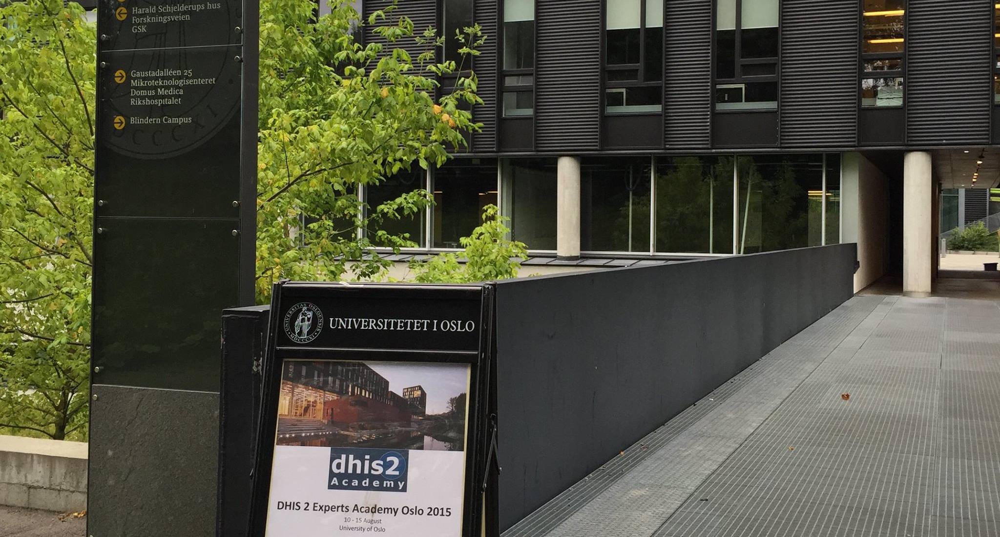

Google Summer of Code is a great opportunity for students not only to find a remote internship, but also to become long-term open source contributors. It is available almost to any students who have experience or knowledge of writing code, regardless of your speciality or physical location. Google has created unprecedented opportunity both for young developers and open source communities, which I think everyone should take advantage of. GSoC is more than just a three months internship, and I hope that this post will be a good example of how it can change anyone's life.

## Being a student

The first time I read about GSoC was in 2013, from a blogpost of a student who has successfully completed the program. As for a second year Computer Science student from Azerbaijan State Oil Academy, opportunity of contributing to open source organization with Google's support was extremely exciting, even more, too good to be true. Decision to apply for next summer of code was made automatically, even without clearly realizing it.

First thoughts were scary rather motivating: "I am not smart enough", "I don't have enough experience" and plenty of other reasons which might convince anyone even not to try. Plethora of smart people will put aside idea of participating just because of not being "good enough". Try not to think about failure, instead focus on what you can and _do_ your best. Google's ["Am I good enough?" guide](http://write.flossmanuals.net/gsocstudentguide/am-i-good-enough/) for students states that you don't have to fulfill 100% of project requirements, 51% and strong will to learn is enough.

### Google Summer of Code 2013

After two months of preparations, dozens of emails sent back and forth to organization mentors, hundreds of hours spent on project prototype and description, it was time to submit proposal. However, the most challenging part turned out to be expectation of results from Google and open source organizations.

According to timeline of GSoC 2013, list of accepted students had to be announced in the evening of 27th May. I still remember myself nervously refreshing GSoC page, in order to finally get an answer if my effort was justified. It is hard to describe how happy I was when I found my name on the list. At that moment, I could not expect that open source will become a part of my daily life for a few next years. In the long run it turned out to be extremely exciting journey, which included participation in Google Summer of Code 2014, full-time job in organization I have been working with, and contribution to GSoC in a role of mentor and organization administrator.

Organization which has selected me was Health Information System Programme. HISP is international, non-profit organization which was founded at University of Oslo. Currently it is based in multiple countries, with largest divisions located in Norway, India, Vietnam, South Africa and US. District Health Information Software 2 (DHIS 2) - is a generic information system created by HISP, which allows to capture and analyze data. During GSoC 2013 my responsibility was to build an android client, which could enable users to collect data on the phone or tablet, and send it back to the DHIS 2 server. Since system is mostly being used in developing countries, where network connection is patchy and unstable, primary concern was ability to operate in offline setting.

Three months later, project was successfully completed. However, I must admit that building application in a such short period of time is a non-trivial task. On the other hand, working on the challenging project with a team of sophisticated developers is a great opportunity for any student to learn fast. I am very grateful to my mentors who guided me throughout the summer and helped me to finish my work in time.

### Google Summer of Code 2014

Key intention of GSoC is not to organize short-term internships, but to raise new generation of open source contributors. This makes a lot of sense, since building software from scratch is a lot easier rather than continuously maintaining it. If students won't stick around after summer, project has to be supported either by community or must be abandoned. This is especially true for projects which timeline simply don't fit into three months.

As for a student, it was very interesting to continue working even after summer. It was not just a synthetic project which was developed as a part of coursework at school. Instead, it was something used by people in the field, something what could benefit community in the long run. Motivated by good feedback, I have been working on application structure and new features throughout rest of the year.

During next iteration of GSoC, HISP introduced new project ideas related to android. This time, main focus was not on data capturing, but analyses of collected data. Since environment in which android apps were intended to be used was constrained, main requirement remained unchanged - everything should work in offline. In the end of 2014, android suite for DHIS2 contained two apps, which were used in several countries where system was a standard for capturing and analyzing health data.

## Getting a job

As final year of bachelors was approaching, hassle around thesis was getting more attention and time rather than contribution to DHIS 2. Right after graduation in May, I got an unexpected email from HISP with offer to join their team onsite at University of Oslo. Opportunity to see the whole team and chance to travel to Norway was extremely exciting for me. Later on, I also got invitation from HISP to participate in annual conference and talk about android apps at University of Oslo.

Everything was happening lightning fast. During next two
weeks I got my visa, and in a one and half months I was ready to leave my home. Moving to another country is a challenging and stressful process, especially if you have not been traveling much before. Absolutely different culture, people, language: all these factors might be scary in the beginning. However, breaking out from comfort zone is very important for personal growth. It took me approximately two months to settle down and adjust to new environment. Many thanks to HISP team, which was very friendly and helpful during my first days in Norway.

Conference was the awesome opportunity to meet people and catch up on the things happening in organization. I have met almost everyone I knew from hundreds of emails and GitHub commits just in a few hours. Of course, remote work is the future (maybe even the present), but it has major downside - lack of live communication. We still need to see and talk to people we work with, that's just a part of our nature.

Attending sessions was also a nice way to learn from community. Gaining understanding of how people use software is a valuable knowledge, which empowers developers to improve and focus on what really matters. Presentation of android apps was a part of agenda. It was very exciting for me and team of android developers to show how mobile platform can complement functionality of DHIS 2. Since it was first time for me talking on stage, presentation was not perfect, but it was great learning experience.

Conference was getting closer to the end and it was time to write some code for DHIS 2!

### Google Summer of Code 2016

During autumn 2015, Google has announced new GSoC iteration. As a part of the team, I was eager to contribute to organization as mentor and administrator. A few months later, when application process for open source organization has begun, we started working on project ideas. Many thanks to everyone on the team who helped with preparations, especially to our former GSoC HISP administrator.

Software development in HISP is mainly driven by people using the system. We asked community, which project ideas they consider to be most valuable and got a lot of interesting proposals. The best part about it is that we got people who not only suggested ideas, but also volunteered as mentors. After a few weeks of preparations and hard work, our application was submitted to Google!

A few weeks later, list of organizations has been officially published and HISP was there as well! We got around 300 hundred emails and 70+ proposals for 7 project ideas. Since quite big portion of applicants was very competent, it was a tough task to decide who should get chance to participate.

In summary, we had 9 mentors guiding 7 students throughout the summer with 6 successfully finished projects at the end. The work which students have done now is gradually getting merged into our repositories. We continue collaboration with two students on development of new functionality for android apps and hope that they will become long-term contributors.

## Summary

Google Summer of Code is a tremendous opportunity for current generation of students. It is a living proof that there is no borders in the modern world, you can do pretty much anything you can imagine by just having computer connected to internet and a good dose of motivation. It is not only a great way to dive into open source world, but also a really good chance to gain work experience. If you are currently a student who loves to write code, you definitely should give it a try.
