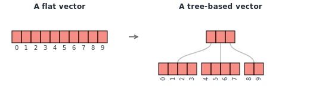
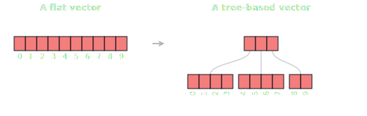
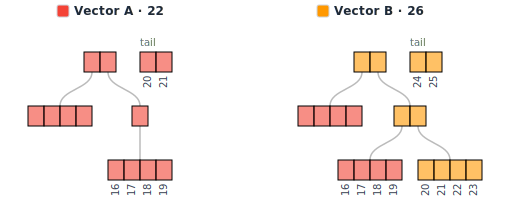
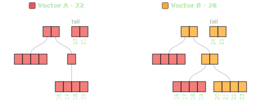
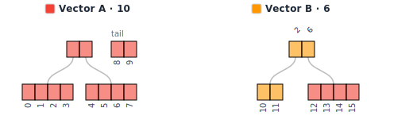
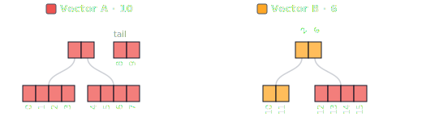

Cloning a vector means copying every element. For small collections this is fine, but as vectors grow, so does the cost. In functional languages, where collections are immutable, cheap copies are vital for performance.

In Rust, this comes up too. Ownership means you must clone a vector if you want to keep using it after passing it somewhere else. As Niko Matsakis [pointed out](https://smallcultfollowing.com/babysteps/blog/2018/02/01/in-rust-ordinary-vectors-are-values/), Rust collections already behave like values; they just have an expensive clone. What if that clone could be nearly free?

That post got me interested in the problem. After some research, I ended up building [pvec-rs](https://github.com/ArazAbishov/pvec-rs), a Rust library implementing persistent vectors based on RRB trees, a variant designed for efficient splitting and concatenation. This post is a visual introduction to how it all works.

## A quick intro to persistent vectors

The idea is to represent a vector as a tree internally. Instead of copying every element, you reuse most of the existing structure. To produce a modified version, you only need to copy the path from the root to the changed leaf. This is called _path copying_. The unchanged nodes are shared between the old and new versions of the tree. This is known as _structural sharing_, and a data structure that preserves previous versions of itself after modification is called _persistent_.

The diagrams in this post use a branching factor of 4 to keep things readable, but in practice 32 or 64 is used for better performance. Wide nodes are CPU cache friendly, and with a branching factor of 32, even ~4 billion elements (the limit of a 32-bit index) fit in a tree just 7 levels deep. That means at most 7 hops to reach any value, making random access effectively O(1).

This data structure is called a Radix Balanced Tree (RB tree). It also keeps a small _tail_ buffer for recent pushes, avoiding a tree traversal on every append. New elements are first collected in the tail and only flushed into the tree when it fills up.

_Path copying in practice. Vector B is a clone of Vector A with 4 extra elements pushed. Red nodes are shared between both vectors. Orange nodes were created when pushing to the clone: only the root and the right branch needed to be copied._

The data structure has its roots in Phil Bagwell's [Ideal Hash Trees](https://infoscience.epfl.ch/record/64398), which Rich Hickey adapted to build Clojure's persistent vector. If you want to learn how it works in more detail, I would highly recommend Jean Niklas L'orange's posts: [part 1](https://hypirion.com/musings/understanding-persistent-vector-pt-1), [part 2](https://hypirion.com/musings/understanding-persistent-vector-pt-2).

## RRB trees

RB tree based vectors have a key weakness: splits and concatenations are O(n). RRB trees (_Relaxed_ Radix Balanced) fix this by allowing nodes to be partially filled, which brings both operations down to O(log n). This matters for parallel code: you can split a vector across threads, process each part independently, then concatenate the results.

Because nodes can now be partially filled, the tree can no longer compute subtree sizes from its shape alone. Each relaxed node stores a size table to keep track.

_A 16-element vector split at index 10. Vector A keeps elements 0-9, with the last two sitting in the tail. Vector B gets elements 10-15. Its left leaf only has 2 of 4 slots filled, so the root needs a size table (the numbers above it: 2, 6) to know how many elements each subtree holds._

## Visualizing it

It took a couple of years of on-and-off hacking, but [web-vis](https://pvec-rs.abishov.com/web-vis/) is finally in good enough shape to share. It compiles pvec-rs to WebAssembly and renders the tree in the browser. Each vector is drawn as a tree, and shared nodes are color-coded, so when you clone and push, you can see exactly which parts were copied and which are still shared. You can grow, shrink, clone, split, and concatenate vectors. If you split or concatenate, you will also see the size tables that relaxed nodes require.

Start by cloning a vector, then push to one of the clones to see path copying in action. [Try it out.](https://pvec-rs.abishov.com/web-vis/)

<!-- web-vis demo -->

  <iframe
    src="https://player.vimeo.com/video/1164810585?autoplay=1&loop=1&title=0&byline=0&portrait=0"
    style="position:absolute;top:0;left:0;width:100%;height:100%;"
    frameborder="0"
    allow="autoplay; fullscreen; picture-in-picture"
    allowfullscreen>
  </iframe>

If you want the full deep-dive (performance benchmarks, implementation details, and all the edge cases), it's all in the [thesis](https://abishov.com/thesis).
